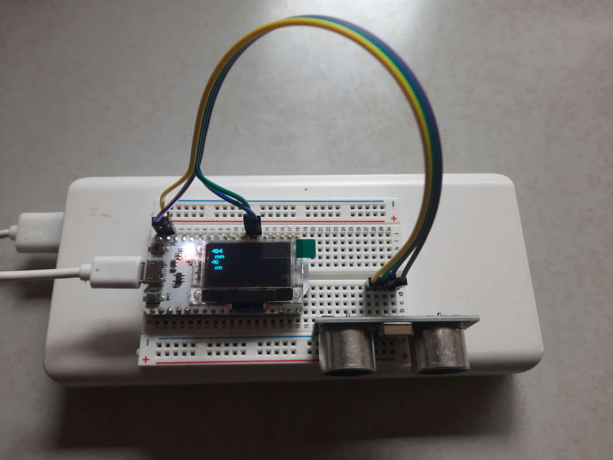

# esp32_ultrasonic

Ultrasonic distance measuring using esp32 with display

## Hardware

* [Heltec ESP32 with ](https://heltec.org/project/wifi-kit-32/)
* HC-SR04 Ultrasonic Sensor

## Software Packages

These packages have to be installed in the Arduino IDE.

* [Heltec](https://github.com/HelTecAutomation/Heltec_ESP32)
* [HCSR04](https://github.com/d03n3rfr1tz3/HC-SR04)
