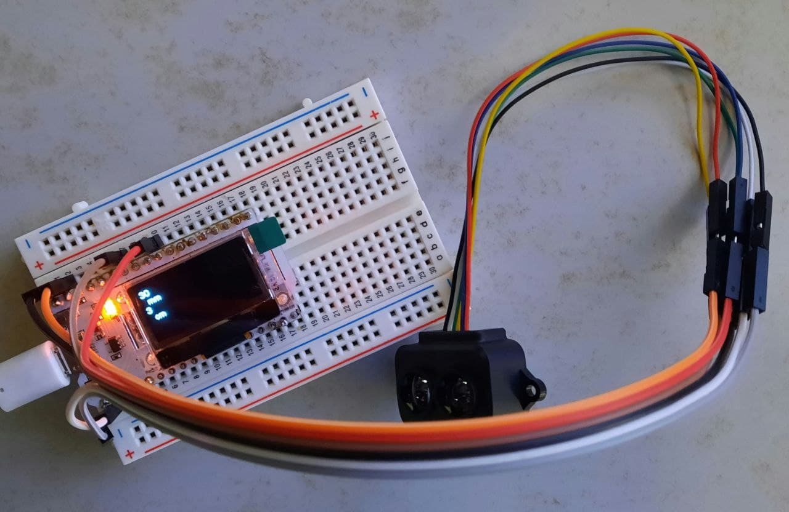
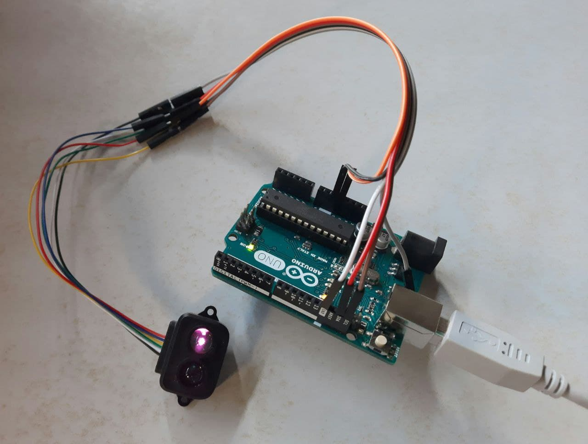

# ESP32 Ultrasonic and Lidar Distance Measurement

Measure distances using the ESP32, combined with both ultrasonic and Lidar sensors, and display the results on a screen.

## 🛠 Hardware Components

* [Heltec ESP32](https://heltec.org/project/wifi-kit-32/)
* HC-SR04 Ultrasonic Sensor
* 
* [TFLuna Lidar Sensor](https://youyeetoo.com/blog/tflunald0023-55)
* 
* 

## 💽 Required Software Packages

Ensure you have the following packages installed in your Arduino IDE:

* [Heltec ESP32 Library](https://github.com/HelTecAutomation/Heltec_ESP32)
* [HC-SR04 Library](https://github.com/d03n3rfr1tz3/HC-SR04)

## 🔗 Pin Connections

Ensure to make the following connections between the ESP32 and the respective sensors. Refer to the [ESP32 Pins](https://resource.heltec.cn/download/WiFi_Kit_32/WIFI_Kit_32_pinoutDiagram_V2.1.pdf) for the detailed pinout diagram.

### Ultrasonic Connections (HC-SR04)

| HC-SR04 Pin | Connection   | ESP32 Pin | Description     |
|-------------|--------------|-----------|-----------------|
| 1           | **GND**      | Ground    | Ground          |
| 2           | **5V (VCC)** | Power     | Power supply    |
| 12          | **Trigger**  | GPIO17    | Trigger Signal  |
| 13          | **Echo**     | GPIO15    | Echo Signal     |

### Lidar Connections (TFLuna)

| TFLuna Pin  | Connection  | ESP32 Pin | Description     |
|-------------|-------------|-----------|-----------------|
| 1           | **5V**      | Power     | Power Supply    |
| 2           | **SDA**     | GPIO4     | Data Line       |
| 3           | **SCL**     | GPIO15    | Clock Line      |
| 4           | **GND**     | Ground    | Ground          |
